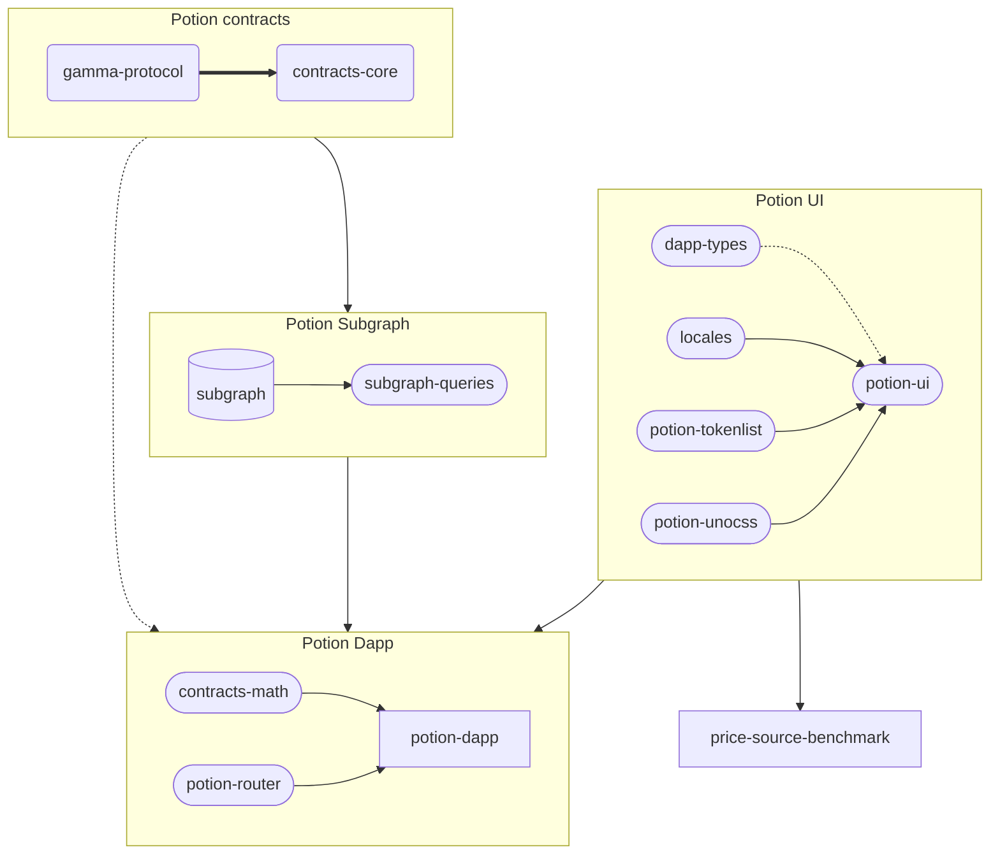

# Potion Protocol

**Amazing risk management protocol!**  
Potion is a decentralized protocol for the creation of price insurance contracts running on the Ethereum network. For more information on how it works, check out the [Potion Docs project](https://github.com/potion-labs/potion-dev/tree/master/potion-docs).

Before getting started please be sure to have installed the [Requirements](#requirements).

## Requirements

The following binaries are required to run the project

- [NodeJS](https://nodejs.org/en/download/) (v16)

  - To install and manage Node we suggest to use [nvm](https://github.com/nvm-sh/nvm) or [fnm](https://github.com/Schniz/fnm)

- [Yarn](https://yarnpkg.com/getting-started/install)

- [Docker](https://docs.docker.com/engine/install/)

- [Docker Compose](https://docs.docker.com/compose/install/)

You can run the `bin/check-dependencies` script to check if everything is installed correctly

## Quick Start

[Setup instructions](./setup_instructions.md)

Some configuration is required before spinning up the environment.  
Run `cp .env.example .env` to copy the environment example file and customize the following variables:

- `VITE_ENDPOINT_PROVIDER` - The provider API is used to read on-chain activity.  
  Choose one between [`infura`](https://docs.infura.io/infura/getting-started) and [`alchemy`](https://docs.alchemy.com/alchemy/introduction/getting-started).  
  (eg: `VITE_ENDPOINT_PROVIDER="alchemy"`)
- `VITE_ALCHEMY_KEY` or `VITE_INFURA_KEY` - Configure one of the two variables using the API key of the provider chosen in the previous step.  
  Eg:
  ```bash
    VITE_ENDPOINT_PROVIDER="alchemy"
    VITE_ALCHEMY_KEY="your api key"
  ```
- `VITE_BLOCKNATIVE_API_KEY` - BlockNative API key to query the [Gas Platform API](https://docs.blocknative.com/gas-platform).  
  A default API key is generated when you sign up and is available in the Dashboard.
- Setup [Ganache volume](#using-ganache-databases)

- Run `./bin/setup-database-seed --all` to automatically copy all database seeds to your `GANACHE_VOLUME` folder using the [setup-database-seed](./bin/setup-database-seed) script

- Run `./bin/setup-local-env` to bootstrap your development environment

- Run `yarn dev potion-dapp` to start Vite development server for [Potion DApp](#appspotion-dapp) on `localhost:3000`  
  or  
  `yarn nx run potion-dapp:local-dev-test` to spin up docker environment and start Vite development for [Potion DApp](#appspotion-dapp) on `localhost:3000` with a [mocked](#mocked-web3-onboard) instance of `web3-onboard` (useful for testing or if you can't connect a wallet)

## Using ganache databases

The ganache container is configured to use databases from a [bind mount](https://docs.docker.com/storage/bind-mounts/), this is used to store our previous interactions and/or restore known states for tests/debugging.  
To make prototyping and testing easier to handle, we have prepared a set of [database seeds](#available-ganache-seeds) that can be found in the `ganache_seeds` folder.

### Setting up ganache databases

1. Create a folder that will be used as a bind mount on the host machine (it is higly recommended to set up it outside the monorepo to avoid permissions issues with tools). See [example](#directory-tree).

2. Put the path (relative or absolute will both work) inside the `.env` file into the `GANACHE_VOLUME` variable. This folder will be mounted to the `/opt` path within the container. See [example](#content-of-env).

3. Put into the `DATABASE_PATH` variable the path (from inside the container) to the database that you want to use. See [example](#ganache-example-config).  
   An absolute path **inside the ganache container** starting with `/opt`. You can choose any name except those that match a seed name from `ganache_seeds` as the bootstrapping process needs a fresh copy of the database to initialize properly.  
    If you already initialized your environment you can also use a path to any of the [available ganache seeds](#available-ganache-seeds) (eg `/opt/base`) and the test data will be loaded.

### Creating/restoring databases

1. Copy the databases in the `ganache_seeds` to the bind mount folder (there is a `setup-database-seed` script into the `bin` folder that will copy the databases in the correct place using your `.env` file).
   It is possible to copy entire folders to "create" a new database (eg, copy the `base` database to `develop`).
2. If you are using the `base` database ensure that `CHAIN_TIME` is set to **2021-01-01 09:00:00+00:00**

### Ganache example config

- #### Directory tree

  ```bash
  root_folder
  |____ potion-protocol
  |____ docker-data
  | |____ potion-protocol
  | | |____ ganache
  ```

- #### Content of `.env`

  ```sh
  ... other variables

  GANACHE_VOLUME="../docker-data/potion-protocol/ganache" # path to a folder on your system, used as source for the ganache bind mount.
  DATABASE_PATH="/opt/base" # path within the ganache container ( '/opt' is required )
  CHAIN_TIME="2021-01-01 09:00:00+00:00"

  ... other variables
  ```

- #### Content of local folder

  `../docker-data/potion-protocol/ganache`

  > base  
  > develop # custom database
  > e2e-create-pool  
  > e2e-show-pool  
  > ... other databases

- #### Content of ganache container

  `/opt`

  > base  
  > develop # this is a custom database
  > e2e-create-pool  
  > e2e-show-pool  
  > tests # this folder is used internally to store db files from e2e-testing  
  > ... other databases

### Available Ganache seeds

You can use any of the pre-made databases by setting `DATABASE_PATH="/opt/{database name}"` in your `.env` file, where `{database name}` is any of the following:

- `base` - Generic seed used as a basic test for: `CustomPoolCreation`, `CustomPotionCreation`, `PoolTemplate`, `EditPool` pages.  
  Sharing the same database instance speeds up testing, as we can avoid reloading the environment and importing a new seed.

- `e2e-show-pool` - Seed specific to `ShowPool` page, to allow testing page features in complete isolation

- `e2e-show-potion` - Seed specific to `ShowPotion` page, to allow testing page features in complete isolation

- `e2e-show-potions` - Seed specific to `ViewPotions` page, to allow testing page features in complete isolation

## Ganache and block time

**IMPORTANT**: Ganache by default uses the host local time to determine the timestamp of the next block, this can cause issues with expirations not working because the time turned back or create inconsistency in the charts.  
To avoid this issue on the CI the `base` database has been created with the date **2020-01-01 00:00:00+00:00** but because the deployment script fast forwards one year you should start the blockchain locally from **2021-01-01 09:00:00+00:00**.  
Every time that you do a fast forward remember to update your starting time to reflect it, otherwise next time that you restart the containers you will incur into a time mismatch.

## Testing

### unit test
The project implements unit tests for `potion-contracts` with [Hardhat](https://hardhat.org/), `potion-subgraph` with [Matchstick](https://thegraph.com/docs/en/developing/unit-testing-framework/) and [Vitest](https://vitest.dev) for `potion-dapp` and `potion-ui`.
Every package has at least one script (eg, `test-unit`) to launch them, for more details check the specific `package.json` of that package.

### e2e
The project currently implements e2e testing for `potion-dapp` and component testing for `potion-ui`.
Both workspaces are configured to use [Cypress](https://github.com/cypress-io/cypress) as a testing tool.

### Potion DApp testing

Tests are located within `cypress/e2e` folder.

#### `yarn nx run potion-dapp:local-test-e2e`

- Spin up Docker environment if not started
- Copy `ganache_seeds` to `DATABASE_PATH` folder
- Start Vite development server with mocked onboard with files from your latest build on `localhost:3000`
- Open Cypress with an interactive session

#### `yarn nx run potion-dapp:ci-test-e2e`

**Requires a running docker environment**

- Build `potion-dapp` with mocked onboard
- Start Vite preview server with files from your latest build on `localhost:5050`
- Run the whole test suite with Cypress headless mode.  
  _Browser defaults to Electron_

To have more control over what commands are issues to start the testing environment you can use:

- `yarn nx run potion-dapp:test-e2e`: Start Vite preview server with files from your latest build and open Cypress interactive session
- `yarn nx run potion-dapp:test-e2e-dev`: Open Cypress interactive session for an existing Vite development server running on `localhost:3000`
- `yarn nx run potion-dapp:test-e2e-ci-dev`: Run the whole test suite with Cypress headless mode for an existing Vite development server running on `localhost:3000`
- `yarn nx run potion-dapp:test-e2e-ci`: Start Vite preview server with files from your latest build and run the test suite with Cypress headless mode

### Potion UI testing

Tests are located within each component subfolder and are named as `{component}.cy.ts`

#### `yarn nx run potion-ui:test-component-ci`

- Run the whole test suite with Cypress headless mode.

#### `yarn nx run potion-ui:cypress`

- Open Cypress with an interactive session

### Mocked `web3-onboard`

In order to test actions involving interaction with a Wallet, a mocked version of `web3-onboard` is injected at compilation time, based on an environment variable. This is also the difference between the commands `yarn nx run potion-dapp:build` and `yarn nx run potion-dapp:build-test`.  
This mocked instance implements all the methods available in the original library that are used within `potion-dapp`, exposing the same interface and also offering the same degree of reactivity. All methods are supposed to be called in an headless environment, thus eliminating the requirement for user interaction.
To achieve the statefulness required by the app, this instance uses a local state to store information and its methods refer to this single source of truth to interact with current state.

## Inner works of test scripts

This is what happens locally behind the scenes to start and seed the environment:

1. Spin up the Docker environment with `docker compose up -d -V`, starting the following services:

   - `potion_postgres`: [PostgreSql](https://github.com/postgres/postgres) database to store indexed data

   - `potion_ipfs`: local [IPFS](https://github.com/ipfs/go-ipfs) instance on which to upload the subgraph

   - `potion_ganache`: [Ganache](https://github.com/trufflesuite/ganache) instance for a local blockchain

   - `potion_graph_node`: [Graph Node](https://github.com/graphprotocol/graph-node) to index the data from the blockchain and expose it using GraphQL

2. Once containers are up and ready to accept new connections:

   - If this is the first time running this environment, seeds the database by running the template and deploying both the contracts and the subgraph

   - If the database is already available, only runs the template for the subgraph and deploys it

## Monorepo overview



This repository hosts all of the code for the Potion Protocol and as such comprises:

- The [DApp](#appspotion-dapp) used to show front-facing information to the end user.
- The [Subgraph](#appssubgraph) that tracks changes Pools, Curves, Criterias, and oTokens, with data aggregated to the pool level.
- The [Contracts](#contractscore) containing the Smart Contracts of the Potion protocol

For ease of maintenance we have a single `package.json` file in the root of the monorepo, which lists all dependencies for all projects.  
Each project then has it's own `package.json` listing all scripts that can be run against that particular project.  
To enchance the development experience we are making use of Yarn workspaces togheter with Nx to simplify and coordinate issuing commands for different projects.  
For example:

```bash
yarn nx run potion-dapp:local-dev
```

- Run a command throught `nx`
- Relative to the `potion-dapp` project
- A command defined either in `package.json` or `project.json`. Scripts defined in a `project.json` are exclusive of Nx and cannot run outside of it

### apps/potion-dapp

[Read more](./apps/potion-dapp/README.md)

Project containing files for the Vue3 app in charge of showing and updating data to and from the protocol.

### apps/subgraph

[Read more](./apps/subgraph/README.md)

Local subgraph tracking updates to the protocol entities.

### bin

This folder contains all scripts developed to assist in spinning up the environment and running development operations.  
These consist of:

- `check-dependencies`: Check for Docker dependencies required to run the stack locally
- `setup-local-env`: Spin up local Docker environment by also checking for available environments and the current Ganache database.
- `setup-database-seed`: Based on supplied parameters copies one or all seeds to your `DATABASE_PATH` folder. When called with `--all` flag, restores all database seeds from `ganache_seeds` folder and creates the `tests` subfolder used in e2e-testing.  
  _Called by default when running `yarn nx run potion-dapp:local-test-e2e`_

### contracts/core

[Read more](./contracts/core/README.md)

Some tests for the core contracts have been currently modified because of an issue between `ethers.js` and `hardhat` where the revert reason emitted
by `hardhat` is not understood by `ethers.js`. The `hardhat` team is working on a fix but as of version 2.9.3 the fix is not yet available. The affected
files are:

- [CurvePricing.test.js](./contracts/core/test/CurvePricing.test.ts)
- [PotionLiquidityPool.Upgrades.test.js](./contracts/core/test/PotionLiquidityPool.Upgrades.test.ts)

### contracts/gamma-protocol

[Read more](./contracts/gamma-protocol/README.md)

This workspace provides the Opyn Gamma protocol contracts, required for the core contracts of the Potion Protocol

### ganache_seeds

This folder contains a set of subfolders containing seed data for Ganache.  
Different seeds are useful for testing different features of the DApp.

### libs/contracts-math

This library provides convenient wrappers and type helpers for working with 59x18 bit fixed-point decimals.

### libs/dapp-types

This library contains a single `index.ts` file with types shared among apps and libraries

### libs/locales

This library contains all locales and their data available within the app.  
For ease of use and to also allow for import within tests those data have been extracted to its own library.

### libs/potion-router

This library contains the Potion Router + an helper library to load the required data from the Potion Subgraph

### libs/potion-tokenlist

This library hosts configuration files for the tokens available on different networks supported by the protocol.

### libs/potion-ui

[Read more](./libs/potion-ui/README.md)

This library contains all the UI components used within Potion DApp.

### libs/potion-unocss

This library contains the configuration used for [UnoCSS](https://github.com/unocss/unocss).  
It's contained in it's own library to share config between apps and libraries.

### libs/subgraph-queries

[Read more](./libs/subgraph-queries/README.md)

This library is used to generate useful javascript/typescript bindings to interact with a graphql endpoint.

## Customization

The project allows for customizing various aspects of it also affecting different workspaces. Listed here are all the required variables (marked as such) and some of the main ones if you want to further customize your setup:

```bash
VITE_SUBGRAPH_ADDRESS="http://localhost:8000/subgraphs/name/potion-subgraph"
VITE_DEVELOPMENT_MNEMONIC="test test test test test test test test test test test junk"
DEPLOYER_MNEMONIC="test test test test test test test test test test test junk"
VITE_BLOCKNATIVE_API_KEY="your BlockNative API key"
VITE_ENDPOINT_PROVIDER="alchemy"
VITE_ALCHEMY_KEY="your Alchemy API key"
VITE_INFURA_KEY=""
GANACHE_VOLUME="../data/ganache"
DATABASE_PATH="/opt/base"
CHAIN_TIME="2021-01-01 08:00:00+00:00"
```

- `VITE_BLOCKNATIVE_API_KEY` - **REQUIRED** This API key is required to fetch gas prices. A default key is generated on sign up and is available in your dashboard.

- `VITE_ENDPOINT_PROVIDER` - **REQUIRED** Choose one of `infura` or `alchemy`. This variable informs the DApp on what provider to use to fetch on-chain activity

- `VITE_ALCHEMY_KEY` or `VITE_INFURA_KEY` - **REQUIRED** What variable to customize depends on what you chose for the provider.

  - In case you have `VITE_ENDPOINT_PROVIDER="alchemy"` you want to customize the `VITE_ALCHEMY_KEY` variable
  - In case you have `VITE_ENDPOINT_PROVIDER="infura"` you want to customize the `VITE_INFURA_KEY` variable

- `GANACHE_VOLUME` - A relative or absolute path on the host machine to mount into the `ganache` container using [bind mounts](https://docs.docker.com/storage/bind-mounts/). The folder will be managed by Docker and should be reserved for this purpose.  
  The content of the `GANACHE_VOLUME` folder is mounted into the container at the `/opt` path. Any database will be available from inside the container at `/opt/{folder name}`
- `DATABASE_PATH` - An absolute path **inside the ganache container** pointing to a folder containing the database files. SIf you specify a folder that does not exist, a new database will be created, on the other hand if you use a path to any of the seeds (eg `/opt/base`), test data will be loaded.
- `CHAIN_TIME` - This environment variable maps to the [Ganache startup option](https://github.com/trufflesuite/ganache#startup-options) `--chain.time` and represents the date that the first block should start
- `VITE_SUBGRAPH_ADDRESS` - Absolute url pointing to a running [Graph Node](https://github.com/graphprotocol/graph-node) deployment.  
  Changes to the value must also be reflected in:

  - [apps/subgraph/package.json](./apps/subgraph/package.json) - Setup and deploy scripts are referencing the subgraph by its name `potion-subgraph`
  - [docker-compose.yml](./docker-compose.yml) - Changing the default port number requires to update the list of exposed ports for the `graph-node` service

- `VITE_DEVELOPMENT_MNEMONIC` and `DEPLOYER_MNEMONIC` - A passphrase of 12 or 24 words. these two must always match

### Environment variables

See `.env.example` for available environment variables and their purpose.
