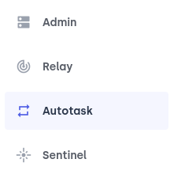

# Potion Protocol Independent Deployment

Potion Protocol relies on the Opyn protocol to provide it's potions and liquidity pools. The Opyn protocol is managed by the Opyn team,
and particularly they manage the update of the Oracle prices for potion's expirations. They also manage the assets that are included
in their system (USDC, wBTC, etc...). While this is fine for a Mainnet deployment, it can get in the way for testing.

While testing, having control of the asset used for collateral is useful, as the operator can decide to mint more of that asset
and send to prospect testers of the system. Also having control of the Oracle update can help settle potions faster, enabling
quicker testing iteration.

For this reason the Potion Team offers a completely independendent deployment where the Opyn contracts are also deployed along
the Potion Protocol. This independent deployment includes a fake ERC20 contract called PUSDC that mocks the functionality of USDC
and that is used as collateral for the protocol.

This independent deployment also includes the subsystem that allows to update the price of the Oracle using ChainLink's external
data feeds.

This readme file includes instructions on how to deploy and operate such an independent deployment in the Ethereum Kovan network.

# Pre-requisites

In order to follow the instructions in this document, readers should be familiar with the top level readme file [potion-procotol/README.md](../README.md)
and the contracts level readme file [potion-protocol/contracts/core/README.md](./README.md). In particular you should be able to deploy the
non-independent version of the protocol to Kovan

# Creating a Relayer in OpenZeppelin Defender

OpenZeppeling offers Defender which is an amazing tool to deploy and manage smart contracts. In particular it has 2 features that are of interest for us:

-   Allows to setup a Relayer contract that can be used to delegate the execution of transactions
-   Allows to setup an Autotask, which is a javascript task that will be executed periodically and uses the relayer to
    send transactions to the blockchain

We will use these 2 features to update the price of the Oracle regularly.

You can find the OZ Defender [here](https://defender.openzeppelin.com/). You must register to access all the functionality, although it is completely free. Once registered, on the menu on the left click on **Relay**:


Then on the top right corner click on **Create Relayer**:


Configure the relayer name and the network you want to deploy it on. In our case this will be Kovan. Then click on **Create**:


It will take a bit of time until it deployes the new Relayer to Kovan. On the next screen take note of the **Ethereum Address** for the relayer, and also its **API Key** and the **Secret Key**. Mark the checkbox that says _I've written down the secret key._ and click on **Go to Relayer**.

It is **VERY IMPORTANT** that you write down the **Secret Key** as it cannot be retrieved later anymore.

# Kovan ETH

You will need to hold some Kovan ETH. You can get some in the following websites:

[ChainLink](https://faucets.chain.link/)
[Gitter](https://gitter.im/kovan-testnet/faucet#)
[MyCrypto](https://app.mycrypto.com/faucet)
[ETHDrop](https://ethdrop.dev/)

A good resource to read on Kovan faucets and how to get other cryptos there is [Alchemist](https://docs.alchemist.wtf/copper/auction-creators/getting-test-tokens-for-balancer-lbps-on-the-kovan-testnet)

We need Kovan ETH in both the deployment wallet and the relayer wallet. Get enough Kovan and send some to the relayer address. Once it arrives you should see its balance in the OpenZeppelin Defender relayer page:


# Configure the pricers

You can find a sample configuration for the pricers in [deployConfig](./scripts/lib/deployConfig.ts)

In the `config` section you can see the definition for the `kovan.independent` network:

```
'kovan.independent': {
    pricerConfigs: [
    ],
    postDeployActions: [
      new DeployChainlinkPricer(
          {
            assetName: 'WETH',
            relayerAddress: '0xba6b224398fc87abced124ba3b34fb2a83c13cec', // OZ Relayer
            assetAddress: '0xd0A1E359811322d97991E03f863a0C30C2cF029C', // WETH
            chainlinkAggregatorAddress: '0x9326BFA02ADD2366b30bacB125260Af641031331', // ETH/USD aggregator
          },
      )
      ...
```

Copy the _Ethereum Address_ of the relayer you just created and paste it in the `relayerAddress` field. The `assetAddress` field is the address of the asset that we'll set the price for. In the example it is _WETH_. And finally the `chainlinkAggregatorAddress` is the address of the ChainLink aggregator that will be used to update the price for the specific asset. You can find the list of ChainLink aggregators for Kovan [here](https://docs.chain.link/docs/ethereum-addresses/#Kovan%20Testnet). In the example we are using the ETH/USD aggregator.

# Deploying

Once we've configured the relayer and change the config file, we can deploy the pricers. In order to deploy the independent version of the protocol you need configure the `KOVAN_MNEMONIC` and `KOVAN_WEB3_ENDPOINT` in the `potion-protocol/potion-contracts/.env` file.

Then to execute the following command inside `potion-protocol/potion-contracts`:

```
$ npm run deploy:kovan.independent
```

This will deploy the Opyn contracts, the Oracle price updater subsystem, the mock PUSDC contract and the Potion Protocol to Kovan.

Once finished, a file called `deploy/kovan.independent.json` should be created, containing the addresses of all needed contracts.

# Preparing the Autotask script

The last step is to create an OpenZeppelin Autotask that will periodically send transactions to the relayer to update the price of our pricer. For this you need to use the file [runOracleBot.js](./scripts/runOracleBot.js) as a template.

Here we need to change some variables to make it work. First of all we need to find out the address of our pricer. You can find it in the file [deploy/kovan.independent.json](./deploy/kovan.independent.json), inside the `pricerContracts` object:

```
 "pricerContracts": {
    "ChainLinkPricerWETH": "0xF7894fc298D4328A4C3a44b97C966d89935B4546"
  },
```

There should be an entry for each pricer that we've configured in the [deployConfig](./scripts/lib/deployConfig.ts). Copy the address and substitute it in the `pricerAddressString` of the `runOracleBot.js` file:

```
var pricerAddressString = '0xF7894fc298D4328A4C3a44b97C966d89935B4546'
```

Then get go to the [deployConfig](./scripts/lib/deployConfig.ts) and copy the `assetAddress` from the `pricerConfigs` object and substitute the value in the `assetAddressString` of the `runOracleBot.js` file:

```
//                       wETH Contract
var pricerAssetString = '0xd0A1E359811322d97991E03f863a0C30C2cF029C'
```

Do the same for the `chainlinkAggregatorAddress` and the `aggregatorAddressString`:

```
//                             wETH/USD aggregator
var aggregatorAddressString = '0x9326BFA02ADD2366b30bacB125260Af641031331'
```

It should look like this:

```
var pricerAddressString = '0xF7894fc298D4328A4C3a44b97C966d89935B4546'
//                       wETH Contract
var pricerAssetString = '0xd0A1E359811322d97991E03f863a0C30C2cF029C'
//                             wETH/USD aggregator
var aggregatorAddressString = '0x9326BFA02ADD2366b30bacB125260Af641031331'
```

We also need to configure the address of the relayer and the address of the Opyn Addressbook. Copy the address of the relayer from the OpenZeppelin Defender and substitute it in the `relayerAddress` variable:

```
  const relayerAddress = '0xba6b224398fc87abced124ba3b34fb2a83c13cec' // Relayer address
```

Then open the [deploy/kovan.independent.json](./deploy/kovan.independent.json) and copy the `opynAddressBookAddress` into the `addressbookAddress` of `runOracleBot.js`:

```
  const addressbookAddress = '0xFda8286e53C77c958D9577b99322825762EdfcfE' // AddressBook module
```

It should look like this:

```
  const relayerAddress = '0xba6b224398fc87abced124ba3b34fb2a83c13cec' // Relayer address
  const addressbookAddress = '0xFda8286e53C77c958D9577b99322825762EdfcfE' // AddressBook module
```

# Creating the Autotask

Now we are ready to create the Autotask. Go to OpenZeppelin Defender and select the _Autotask_ option:



Click on the _Create Autotask_ button on the top right:


Give it a name, select the _Schedule_ option, with _Timespan_ as the schedule type, and configure it to run every 12 hours. Then from the _Connect to a relayer_ drop down menu, select the relayer that we've created in previous steps. As a final step copy the code from [runOracleBot.js](./scripts/runOracleBot.js) and paste it in the _Code_ text field. Make sure to completely replace the default code that OpenZeppelin proposes to you:


Once created you will see a screen like this:


Click on _Run autotask now_ to check if the autotask works. You should see something like this:


The output may be slightly different depending on the time of the day and whether the price of the Oracle has been already updated or not.

The autotask will run twice everyday and it will set the price of the Oracle when it runs after 8 hours UTC. Running it twice ensures that no more than 12 hours will pass from 8 UTC before the price is set.

# Running the Autotask locally

If the autotask is not working, you can run it locally to test it. For this you need to setup your API Key and API Secret in the `.env` file in the @potion-protocol/core project. Use the [.env.sample](./.env.sample) file as a template and fill in the `OZ_AUTOTASK_API_KEY` and `OZ_AUTOTASK_API_SECRET` variables to the corresponding values that you got when you created the relayer.

Then you can run the bot locally by doing:

```
$ node ./scripts/runOracleBot.js
```

This will run the bot and update the price if needed. If there is any problem running the bot it is most probably because on the configured addresses in the bot script is not correct. Please check the addresses and make sure they are as indicated in the [above section](#preparing-the-autotask-script)

# Wrap-up

And that should be it! Now the autotask will keep the Oracle updated for the configured pricer. For more pricers you can add more configurations in the [deployConfig](./scripts/lib/deployConfig.ts) file and then you need to configure separate autotasks to run for each pricer. However you can reuse the same _Relayer_ for all the autotasks, just remember to keep it funded with Kovan ETH.
